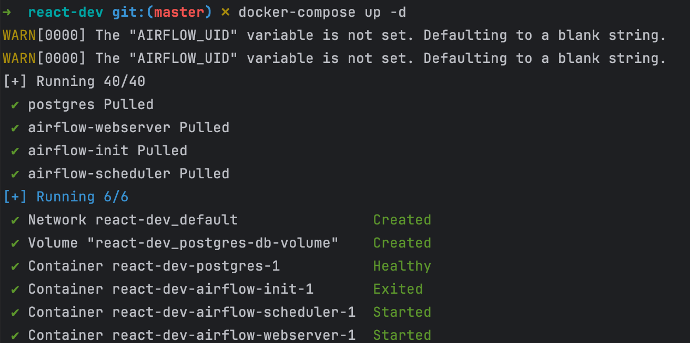
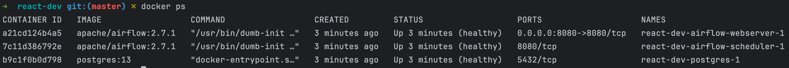
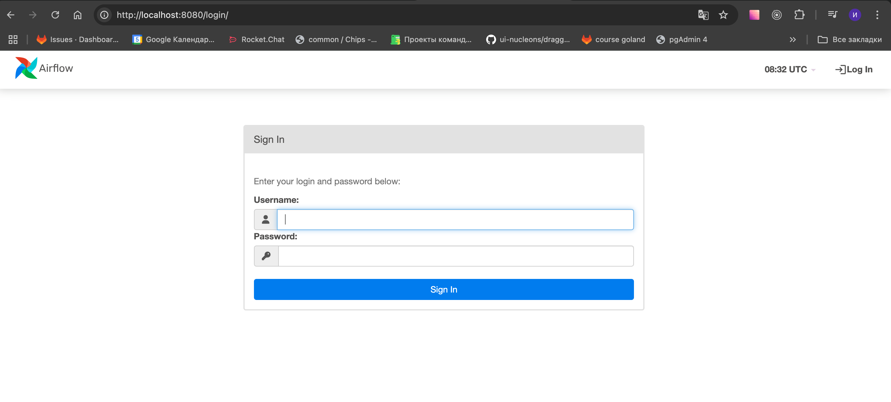
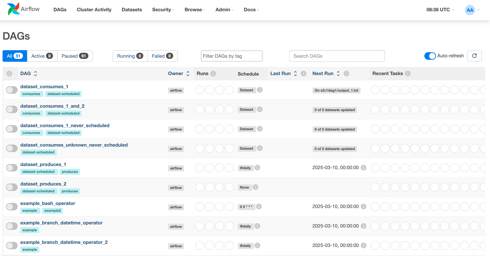

# Лабораторная работа №1 - Airflow + docker compose

## Цель работы

Развернуть _Apache Airflow_ с помощью _docker-compose_

## Ход работы

### 1. Скачиваем готовый _docker-compose.yaml_.

Скачаем файл **docker-compose.yaml** с 
[офф. сайта](https://airflow.apache.org/docs/apache-airflow/stable/howto/docker-compose/index.html) _Airflow_.

### 2. Удаляем избыточные сервисы.

В текущей конфигурации необходимо удалить следующие сервисы:
* redis;
* airflow-worker;
* airflow-triggerer; 
* airflow-cli;
* flower.

Оставляем только основные компоненты:
* webserver;
* scheduler;
* init;
* postgres (база данных).

### 3. Изменяем образ _Airflow_.

Необходимо заменить используемый образ на более конкретную версию:

```yaml
# Вариант 1: Прямая замена в сервисах
image: apache/airflow:2.7.1

# Вариант 2: Через переменную среды
AIRFLOW_IMAGE_NAME: apache/airflow:2.7.1
```

### 4. Настраиваем Executor.

Поскольку мы отключаем сервис **airflow-worker**, необходимо изменить тип исполнителя:

```yaml
AIRFLOW_CORE_EXECUTOR: LocalExecutor
```

### 5. Удаляем зависимости от _Redis_.

В блоке **&airflow-common-depends-on** следует удалить строки, связанные с сервисом _Redis_, так как мы его отключаем. 
Например:

```yaml
depends_on:
  # Удаляем эти две строки:
  # - redis
  # - redis-condition
  - postgres
  - postgres-condition
```

### 6. Настраиваем учетные данные (опционально).

При желании можно настроить собственные учетные данные для входа в веб-интерфейс _Airflow_:

```yaml
AIRFLOW_WWW_USER_USERNAME: имя_пользователя
AIRFLOW_WWW_USER_PASSWORD: пароль
```

Если эти переменные будут заполнены, они заменят стандартные учетные данные **(airflow:airflow)** при доступе 
к веб-интерфейсу через браузер.

В итоге у нас должна получиться следующая конфигурация [docker-compose.yaml](./docker-compose.yaml).

### 7. Проверка работоспособности _Airflow_.

После выполнения команды `docker-compose up -d` надо подождать когда контейнеры запустятся:



Последующей командой `docker ps` проверить статуса контейнеров, вы должны увидеть следующие запущенные 
контейнеры:

* airflow-webserver (на базе образа Apache Airflow)
* airflow-scheduler (на базе образа Apache Airflow)
* airflow-postgres (контейнер с базой данных PostgreSQL)



Сразу после запуска контейнеры могут находиться в статусе _(health: starting)_. Это нормальная ситуация, так как 
системе требуется время для полной инициализации:

* База данных _PostgreSQL_ выполняет начальную настройку;
* _Airflow_ проводит необходимые миграции БД;
* Веб-сервер завершает подготовку всех компонентов.

> **Важно:** Необходимо дождаться, пока все контейнеры перейдут в состояние _(healthy)_, что свидетельствует о полной 
готовности системы к работе!

После успешного запуска вы можете получить доступ к веб-интерфейсу _Airflow_ по следующему адресу:

```
http://localhost:8080/
```



После авторизации в веб-интерфейсе вы увидите предустановленные примеры _DAG-ов_, которые помогут вам познакомиться с 
возможностями платформы.



## Вопрос - ответ.

**Вопрос**: Для чего нужен _docker-compose_?

<details>
  <summary>Ответ</summary>
  Docker-compose нужен для того, чтобы сделать работу с контейнерами проще и удобнее. Представим, что у нас есть 
  сложное приложение, которое состоит из нескольких частей (например, веб-сервер, база данных, кэш и т.д.). 
  Без compose нам пришлось бы вручную запускать каждый контейнер, настраивать их взаимодействие, следить за 
  зависимостями.

  С помощью compose мы можем описать все настройки в одном файле (docker-compose.yml), и потом управлять всем 
  приложением одной командой. Это как пульт от телевизора - вместо того чтобы нажимать 10 кнопок на самом телевизоре, 
  мы используем один пульт для всех функций.
</details>

**Вопрос**: Как в _docker-compose_ сделать ограничения для контейнера по ресурсам (CPU, RAM)?

<details>
  <summary>Ответ</summary>
  Для ограничения ресурсов контейнера в docker-compose нужно использовать специальные свойства в файле 
  docker-compose.yml. Вот как это сделать:
  <pre><code>
    version: '3.7'
    services:
      my-service:
        deploy:
          resources:
            limits:
              cpus: '2'
              memory: '256M'
            reservations:
              cpus: '1'
              memory: '128M'
  </code></pre>
</details>

## Вывод

В результате мы научились:
- Настраивать docker-compose.yaml;
- Запускать контейнеры с помощью _docker-compose_.
