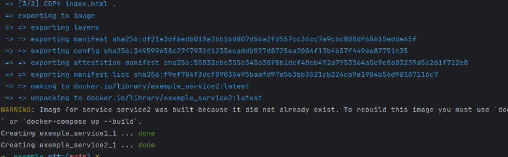

# Лабораторная работа №2* - Написание _Docker compose_ файла 

## Цель работы

Правильно писать _Docker Compose_ файлы и понимать основные практики и антипрактики.

## Ход работы

### Плохой _Docker Compose_

Начнем с создания "плохого" _Docker Compose_ файла и потом исправим его, а также разберём все ошибки.

```yaml
version: '3'
services:
  service:
    image: nginx
    ports:
      - "80:80"
    volumes:
      - ./service_1:/usr/share/nginx/html

  service2:
    image: nginx
    ports:
      - "81:80"
    volumes:
      - ./service_2:/usr/share/nginx/html
    depends_on:
      - service_1
```

1. **Неуказанные версии образов:** Использование образа без версии может привести к проблемам с совместимостью и 
неожиданным изменениям при обновлениях.

2. **Проброшенные порты по умолчанию:** Использование стандартных портов `80` и `81` без указания хостового порта может 
привести к конфликтам, если на хосте уже используется этот порт.

3. **Зависимость одних сервисов от других без надобности:** Использование `depends_on` автоматически 
не гарантирует, что сервис будет запущен и доступен готовым к использованию. Это может вызвать ненужные задержки при 
развертывании.

### Корректный _Docker Compose_

```yaml
version: '3.8'
services:
  service1:
    image: nginx:1.21.3-alpine
    ports:
      - "8081:80"
    volumes:
      - ./service1:/usr/share/nginx/html
    networks:
      - service1-net

  service2:
    image: nginx:1.21.3-alpine
    ports:
      - "8082:80"
    volumes:
      - ./service2:/usr/share/nginx/html
    networks:
      - service2-net

networks:
  service1-net:
  service2-net:
```

1. **Неуказанные версии образов:** Явно указана версия образа `nginx:1.21.3-alpine`. Обеспечивает 
стабильность и предсказуемость выполнения сервисов.

2. **Проброшенные порты по умолчанию:** Указаны уникальные порты хоста `8081` и `8082`, чтобы избежать конфликтов. 
Позволит избежать конфликтов портов и дало возможность развернуть несколько экземпляров без проблем.

3. **Зависимость одних сервисов от других без надобности:** Удаление `depends_on` для повышения автономности сервисов. 
Упрощает параллельный запуск сервисов и уменьшает временную зависимость одного от другого.

> Так же хорошим тоном было бы использовать ограничение ресурсов и переменные, что бы избежать дублирования.

### Запуск контейнера

#### Установка _Docker_ и _Docker-compose_

Для начала надо будет установить _Docker_, но здесь мы этот момент опустим, т.к. можете с ним ознакомиться на 
[офф.сайте](https://docs.docker.com/get-started/). Так же нам понадобится _docker-compose_. Если по каким-то причинам
он у вас не установился, то стоит выполнить команду (для _Linux_):

```bash
sudo apt install docker-compose
```

Создадим следующую структуру для удобства:

```
exemple/
├── service_1/
│   ├── index.html
│   └── Dockerfile
├── service_2/
│    ├── index.html
│    └── Dockerfile
└── Dockerfile
```

Настроим конфигурацию и не забудем добавить любое приветствие в наши `.html` файлы, что бы различить контейнеры.
Конфигурацию для _Dockerfile_ можно взять из [первой лабораторной работы](../lab_2/Dockerfile), а для 
_docker-compose_ ниже:

```yaml
version: '3.9'
services:
  service1:
    build:
      context: ./service_1
    ports:
      - "8081:80"
    networks:
      - service1-net

  service2:
    build:
      context: ./service_2
    ports:
      - "8082:80"
    networks:
      - service2-net

networks:
  service1-net:
  service2-net:
```

Теперь в директории, где лежит _docker-compose_ файл выполняем команду:
```bash
docker-compose up -d
```

Если вы всё сделали правильно, то когда контейнеры соберутся и запустятся вы увидите сообщение:



Откройте браузер и перейдите по следующим адресам:
- Service 1: http://localhost:8081
- Service 2: http://localhost:8082

Вы должны попасть на страницу каждого сервиса: 


Чтобы остановить контейнеры, используйте команду:

```bash
docker-compose down
```

### Изоляция между контейнерами

В корректной версии _Docker Compose_ каждой службе присвоена своя собственная сеть `service1-net` и `service2-net`, 
что обеспечивает изоляцию сетей. Т.к. контейнеры из разных сетей не могут видеть друг друга.

**Принцип работы:** _Docker Compose_ позволяет определять пользовательские сети, и контейнеры, подключенные к разным 
сетям, они не будут иметь сетевой доступ друг к другу. Это эффективно изолирует их на уровне контейнеров, обеспечивая 
дополнительный уровень безопасности и организованности.

## Вывод

Правильное написание _Docker Compose_ файлов является важным аспектом разработки и управления 
контейнеризованными приложениями. Что способствуют созданию более устойчивых, управляемых и безопасных 
многоконтейнерных приложений, которые легче развертывать, обновлять и поддерживать.

[назад](../lab_2/REPORT.md) | [меню](../../README.md)
