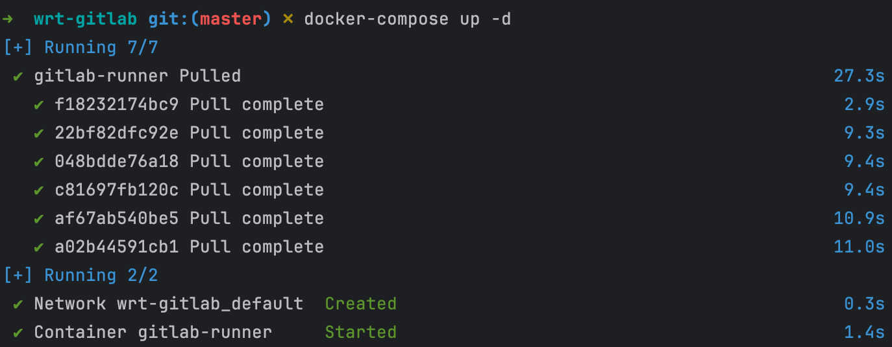
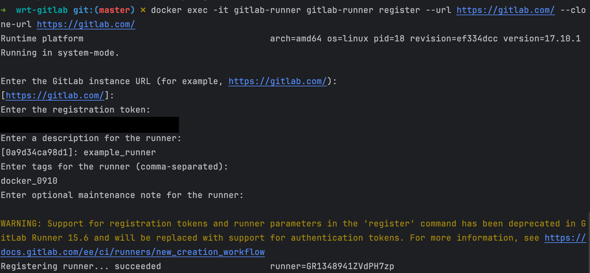
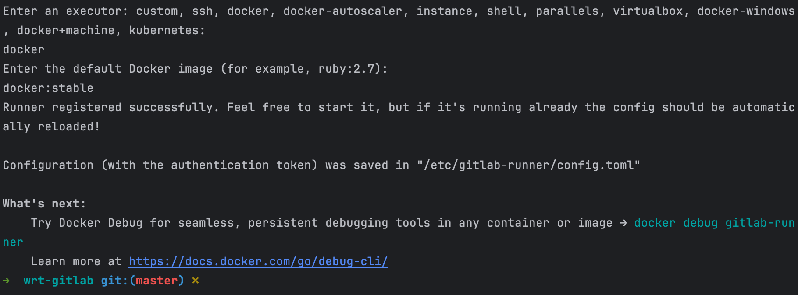
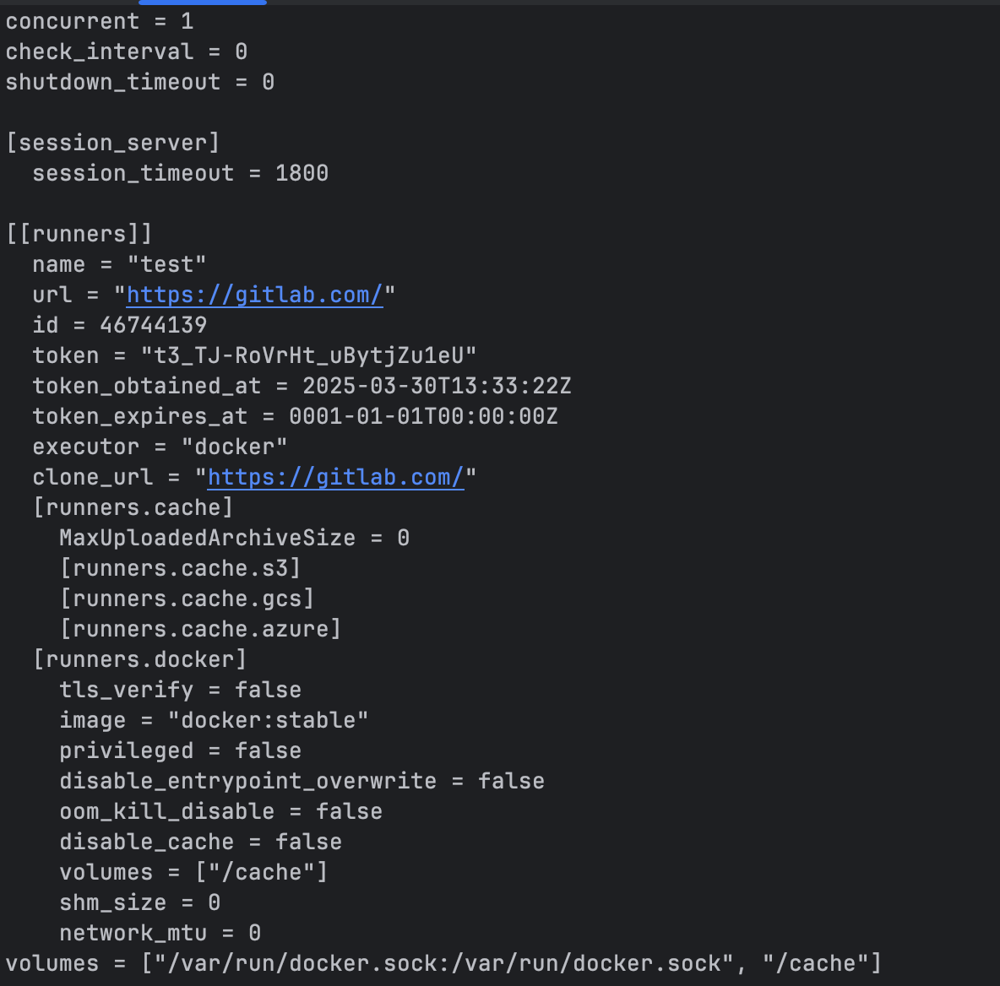
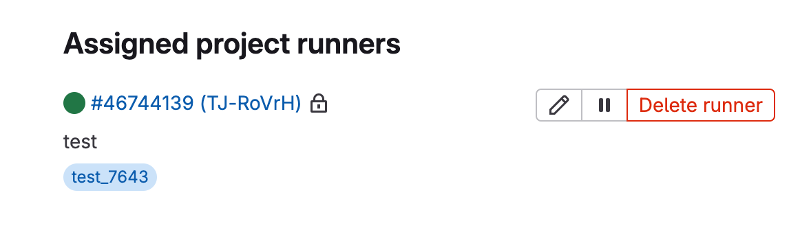
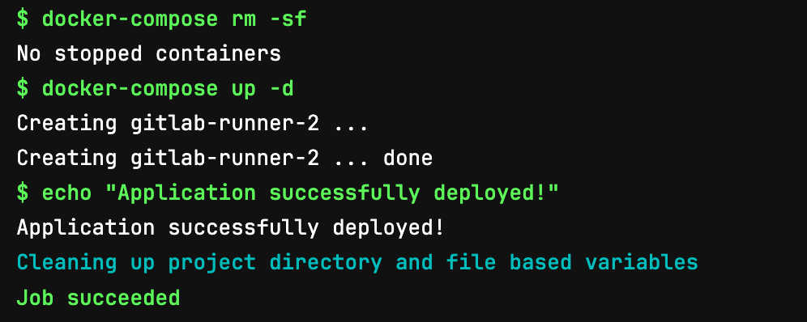
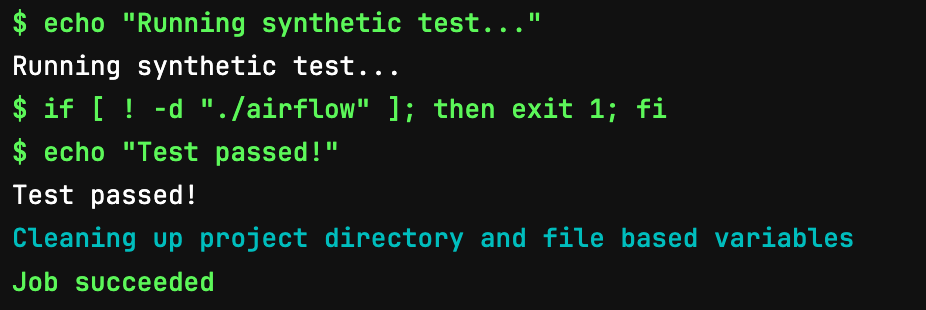
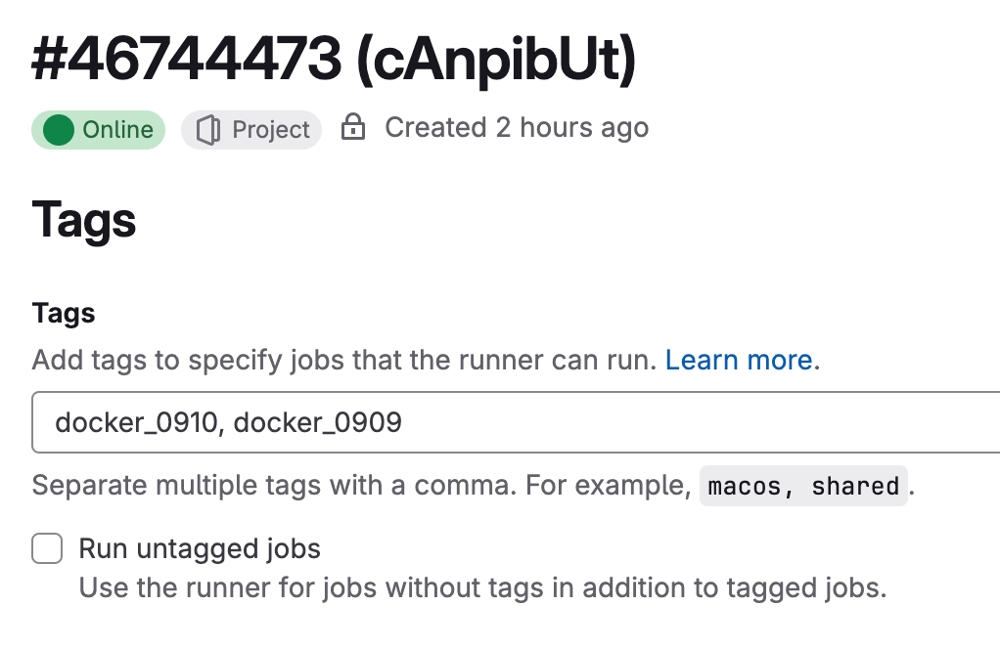

# Лабораторная работа №2 - Gitlab CI/CD

## Цель работы

Создать и настроить свой первый pipeline в _GitLab_

## Ход работы

### Часть 1. Установка и настройка _Gitlab_.

На сервере, куда планируется развёртывание (в том числе локально), необходимо создать файл 
[docker-compose.yml](docker-compose.yaml) для локального развёртывания runner'а:

```yaml
version: '3.7'
services:
    gitlab-runner:
        image: gitlab/gitlab-runner:alpine
        container_name: gitlab-runner
        restart: always
        volumes:
          - /var/run/docker.sock:/var/run/docker.sock
```

В терминале выполните команду `docker-compose up -d`, чтобы запустить контейнеры в фоновом режиме. 
Дождитесь завершения развёртывания, а затем проверьте статус контейнеров с помощью команды `docker ps`.



В _GitLab_ перейдите в нужный проект, затем в раздел `Settings — CI/CD`. 
Откройте пункт **Runners** и скопируйте **registration token**.

Для инициализации **GitLab Runner** в терминале выполните следующую команду:

```
docker exec -it gitlab-runner gitlab-runner register --url "урл_гитлаба" --clone-url "урл_гитлаба"
```

Вам потребуется ввести скопированный ранее registration token, URL вашего GitLab сервера и другие 
необходимые параметры для настройки раннера:

1. Вставьте нужный **URL** для доступа к _GitLab_:
   - Для публичного _GitLab_ используйте https://gitlab.com/;
   - Если используется другой экземпляр, укажите соответствующий **URL**.
2. Укажите описание раннера (Description) — можно использовать любое имя для удобной отладки.
3. Вставьте ранее скопированный токен для регистрации раннера. 
4. Придумайте сложный тег для раннера, чтобы он не совпал с дефолтными раннерами _GitLab_ (например, docker_0910). 
5. Оставьте поле для заметки о техническом обслуживании (maintenance note) пустым. 
6. Выберите тип раннера: `docker`. 
7. Укажите дефолтный образ для раннера: `docker:stable`.




После первоначального запуска _GitLab Runner_ необходимо дополнительно настроить его. 
Для этого нужно войти в контейнер с помощью команды `docker exec -it gitlab-runner bash` и открыть 
файл ` vi /etc/gitlab-runner/config.toml`. 

Затем следует добавить необходимую строку в конец этого файла:

```toml
volumes = ["/var/run/docker.sock:/var/run/docker.sock", "/cache"]
```



И перезапустить контейнер `docker restart gitlab-runner`.

Чтобы убедиться, что **runner** успешно подключён, вернитесь в веб-интерфейс _GitLab_ и проверьте раздел 
`Assigned project runners` в настройках вашего проекта. Там должен отображаться добавленный раннер.



### Часть 2. Создание pipeline.

Откройте свой репозиторий в **GitLab**.
Создайте конфигурационный файл для пайплайна в корне репозитория `.gitlab-ci.yml`:

```yaml
stages:
   - build # стейдж для билда образа
   - deploy # стейдж для деплоя сервиса

deploy-job:
   stage: deploy
   image: tmaier/docker-compose:latest # чтоб сделать деплой через композ нам нужен.. композ
   variables:
   DOCKER_DRIVER: overlay2
   tags:
    - docker_0910
   script:
      - echo "Deploying application..."
      - ls -la
      - docker-compose rm -sf # предварительно чистим уже существующее
      - docker-compose up -d # деплоим по-старинке
      - echo "Application successfully deployed!"
      - 
clear-job: # дополнительная джоба, которая одноразово сотрет задеплоенное
   stage: deploy
   image: tmaier/docker-compose:latest
   variables:
   DOCKER_DRIVER: overlay2
   tags:
    - docker_0910
   script:
    - docker-compose rm -sf
   when: manual # только ручное выполнение (после выполнения лабораторной, например)
```

После того как вы сделаете коммит файла `.gitlab-ci.yml`, пайплайн запустится автоматически. 
Чтобы отслеживать ход выполнения, перейдите в раздел **CI/CD — Pipelines**. Обратите внимание, что запуск и 
выполнение пайплайна может занять несколько минут.



Если на третьем этапе все прошло успешно и результаты отмечены зелёным цветом, это означает, что пайплайн отработал 
без ошибок и приложение было успешно развёрнуто. Чтобы убедиться в том, что тестовое приложение действительно 
развёрнуто, можно воспользоваться терминалом и выполнить команду `docker ps`. Эта команда покажет список всех 
работающих контейнеров _Docker_, и вы сможете проверить, что ваше приложение запущено.

### Задание.

Необходимо выполнить следующие шаги:

1. Добавить новый этап `test` в пайплайн и создать соответствующую джобу, которая будет выполняться до этапа деплоя:
   - Задача джобы — провести «тест», например, проверить, что нужные директории в _Airflow_ существуют и не потерялись.
   - Важно, чтобы этот синтетический тест останавливал выполнение пайплайна, если джоба завершается с ошибкой.
2. Добавить правило для автоматического выполнения шага деплоя только для веток **main** и **develop**:
   - Это правило гарантирует, что деплой будет осуществляться только при изменениях в указанных ветках.
3. Настроить выполнение шага тестирования так, чтобы оно проводилось во всех ветках:
   - Тестирование должно выполняться независимо от конкретной ветки.
4. Настроить созданный раннер так, чтобы он мог использоваться только для тегированных джоб:
   - Это настройка выполняется в веб-интерфейсе GitLab, где можно задать соответствующие теги для раннеров.

<details>
  <summary>Решение</summary>
  Добавим джобу test-job в .gitlab-ci.yml:
  <pre><code>
    test-job:
     stage: test
     image: alpine
     script:
       - echo "Running synthetic test..."
       - if [ ! -d "./airflow" ]; then exit 1; fi
       - echo "Test passed!"
     allow_failure: false
  </code></pre>

  В stages укажем test:
  <pre><code>
    stages:
      - build
      - test
      - deploy
  </code></pre>

  Укажем перечень веток для остальных джоб через only:
  <pre><code>
   only:
    - main
    - develop
  </code></pre>

   

   Чтобы настроить GitLab Runner для выполнения только тегированных заданий (jobs), выполните следующие шаги:
   <ol>
      <li>Перейдите в настройки проекта в GitLab:</li>
         <ul>
            <li>Откройте ваш проект в GitLab.</li>
            <li>Выберите раздел Settings (Настройки).</li>
         </ul>
      <li>Выберите раздел CI/CD:<li>
         <ul>
            <li>В меню настроек найдите и выберите раздел CI/CD.</li>
         </ul>
      <li>Настройте теги для GitLab Runner:</li>
         <ul>
            <li>Найдите раздел, связанный с GitLab Runner (например, Runners).</li>
            <li>
               Здесь вы можете добавить теги для ваших runners. Теги — это метки, которые позволяют вам 
               классифицировать runners и назначать им определённые задания.
            </li>
         </ul>
      <li>Добавьте теги для вашего GitLab Runner:</li>
         <ul>
            <li>
               Введите теги, которые будут присвоены вашему GitLab Runner. Например, вы можете добавить тег docker, 
               если ваш runner настроен для работы с Docker.
            </li>
            <li>Сохраните изменения.</li>
         </ul>
   </ol>

   
</details>

### Отчет.

- Файл [docker-compose.yaml](../../docker/airflow/docker-compose.yaml) из первой лабораторной работы;
- Файл [docker-compose.yaml](docker-compose.yaml) из текущей лабораторной работы;
- Файл [.gitlab-ci.yml](.gitlab-ci.yml);
- Проект в [gitlab](https://gitlab.com/qoudo/webpack-react-template);
- [Pipelines](https://gitlab.com/qoudo/webpack-react-template/-/pipelines).

## Вывод

В результате мы научились:
- Настраивать pipeline Gitlab'а;
- Настраивать Runners Gitlab.
