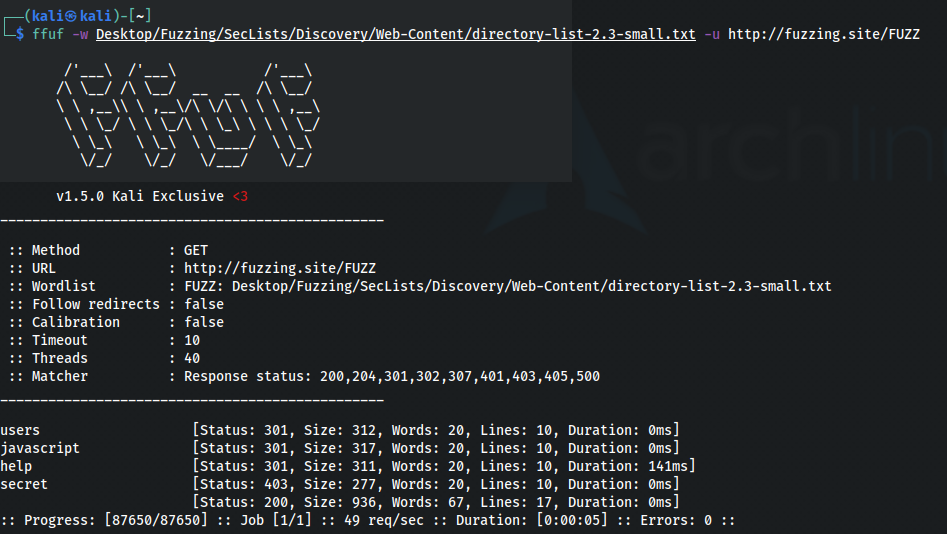
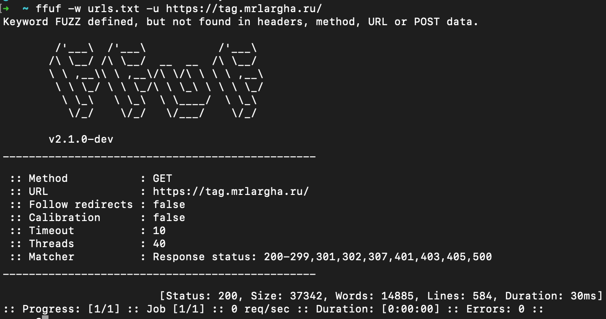
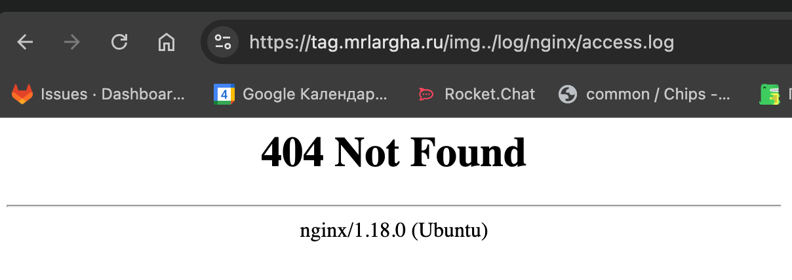
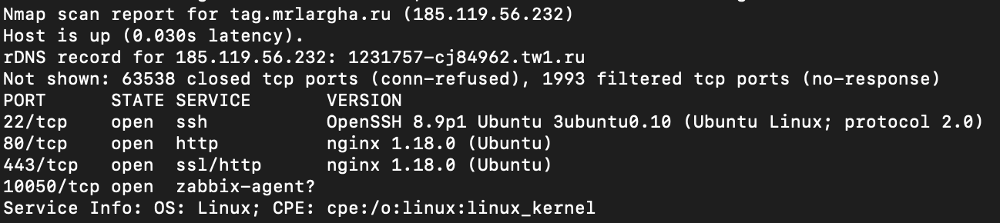

# Лабораторная работа №1 - Попробовать взломать nginx одногруппника 

## Цель работы

Ознакомиться с возможными уязвимостями _Nginx_.

## Ход работы

### 1. Фаззинг каталогов

#### 1.1 Установка _FFUF_

Один из первых шагов в тестировании веб-приложений — поиск скрытых директорий и файлов. И для этого установим утилиту 
_FFUF_. В моём случае устанавливать будем на _Mac OS_, если у вас другая ОС, то можете найти инструкции на внешних источниках.

1. Убедитесь, что у вас установлен менеджер пакетов Homebrew. Если нет, следуйте инструкциям на официальном сайте 
_Homebrew_ для его установки.
2. `brew update` — Откройте терминал и обновите список пакетов, если необходимо;
3. `brew install ffuf` — Установите _FFUF_ с помощью команды.

#### 1.2 Находим словарь

Для перебора url'ов нам необходимо использовать словарь с разными комбинациями путей для перебора.
Можете поискать на просторах _github_, там множество разных словарей в открытом доступе.

#### 1.3 Запуск _FFUF_

Выполним следующую команду:
```bash
ffuf -w urls.txt -u https://tag.mrlargha.ru/
```
Где, `urls.txt` - путь до вашего словаря, `https://tag.mrlargha.ru/` - домен для перебора

#### 1.4 Итог

В результате, если поиск положительный, то вы увидите следующие:



Где, _users, javascript, help, secret_ - пути по которым мы можем попасть в другие разделы сайта. В данном случаи
стоит обратить внимание на раздел secret в который мы явно не должны попадать.

В моем же случаи поиск не дал каких либо результатов:



### 2. Nginx Alias Traversal

#### 2.1 Исследование

Следующий вид уязвимости _Nginx Alias Traversal_, похожий на прошлый, но с некими отличиями. Если в первом случаи мы
искали скрытые каталоги и роуты от пользователей, то теперь мы постараемся попасть в директорию нашего сервера
который написан на _Nginx_.

#### 2.2 Условия

Чтобы техника сработала нужны следующие условия:
 - Директива `location` не должна иметь завершающую косую черту;
 - Директива `alias` должна быть указана внутри `location` и должна заканчиваться косой чертой.


#### 2.3 Принцип работы

В этом примере _Nginx_ настроен так, чтобы сопоставлять любые URL-адреса, начинающиеся с `/img`, и возвращать всё, что 
следует за этой косой чертой, добавляя путь `/var/images/` с помощью директивы _alias_.

Это значит, что запросы `/img/profile.jpg` и `/img/profile.jpg` вернут один и тот же файл. Поскольку директива _alias_ 
заканчивается косой чертой, дополнительная косая черта не нужна после совпадающего местоположения.

Мы можем получить доступ к целевой папке через любой URL-адрес запроса, начинающийся с `/img`, и попытаться получить 
доступ к вездесущему каталогу `..`, тем самым достигнув родительского каталога для целевого, отправив запрос к `/img...`

Если мы получаем ответ о редиректе от _Nginx_, мы можем предположить, что _Nginx_ обнаружил каталог и пытается 
перенаправить нас в `/img../`, как это обычно происходит при доступе к каталогу.

Таким образом, любой файл или дочерний каталог в родительском каталоге целевой папки будут доступны для нас, и 
_Nginx_ с готовностью их вернёт. В нашем лабораторном примере это означает, что мы можем получить доступ ко всем файлам 
в папке `/var/`, учитывая, что целевая папка в конфигурации — `/var/images/`. Это позволяет нам использовать простые 
приёмы, такие как _GET_ `/img../log/nginx/access.log` для загрузки логов, расположенных в `/var/log/nginx/access.log`.

#### 2.3 Итог

В результате нескольких вариантов перебора наш перебор не дал результатов:



### 3. DoS-атака

#### 3.1 Установка _nmap_

1. Убедитесь, что у вас установлен менеджер пакетов _Homebrew_. Если нет, следуйте инструкциям на официальном сайте
   _Homebrew_ для его установки.
2. `brew update` — Откройте терминал и обновите список пакетов, если необходимо;
3. `brew install nmap` — Установите _nmap_ с помощью команды.

#### 3.2 Сканирование портов

Выполним команду: 
```bash
nmap -sV -Pn -p- -T5 tag.mrlargha.ru
```
В результате получим список открытых портов и название приложений которые их используют:


#### 3.2 Запуск скрипта
Воспользуемся встроенным скриптом [http-slowloris](https://nmap.org/nsedoc/scripts/http-slowloris.html) для проверки 
уязвимости на DoS-атаки, выполним команду:

```bash
nmap --script http-slowloris --max-parallelism 400 185.119.56.232
```

#### 3.3 Итог

В результате мы увидим отчет DoS-атаки:
```
PORT     STATE SERVICE REASON  VERSION
80/tcp   open  http    nginx http  1.18.0 ((Ubuntu))
| http-slowloris:
|   Vulnerable:
|   the DoS attack took +2m22s
|   with 501 concurrent connections
|_  and 441 sent queries
```
## Вывод

В итоге мы познакомились с несколькими уязвимостями _Nginx_, которые стоит учитывать при написании конфигурации.

