# Лабораторная работа №3 - Loki + Zabbix + Grafana

## Цель работы

Реализовать систему мониторинга и логирования для тестового сервиса _Nextcloud_ с последующей визуализацией 
данных в _Grafana_.

## Ход работы

### Часть 1. Настройка логирования.

Необходимо разработать комплексную конфигурацию _Docker Compose_, включающую следующие компоненты:

- Nextcloud - основной тестовый сервис;
- Loki - система агрегации логов;
- Promtail - агент сбора логов;
- Grafana - платформа для визуализации данных;
- Zabbix - система мониторинга;
- PostgreSQL - база данных для _Zabbix_.

Результат конфигурации можно посмотреть в файле [docker-compose.yml](docker-compose.yml).

Далее необходимо подготовить конфигурационный файл для Promtail, который будет использоваться в _Docker Compose_. 
Имя файла может быть любым, например `promtail_config.yml`, главное чтобы оно точно соответствовало тому, что указано в 
конфигурации `docker-compose.yml`.

Результат конфигурации можно посмотреть в файле [promtail_config.yml](promtail_config.yml).

Теперь запустим наш docker-compose.yml и убедимся, что сервисы запустились:

```
docker-compose up -d
```

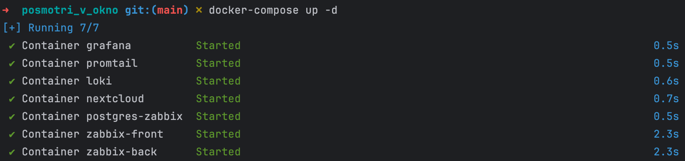

Открываем адрес localhost:8080 в браузере и регистрируем аккаунт:

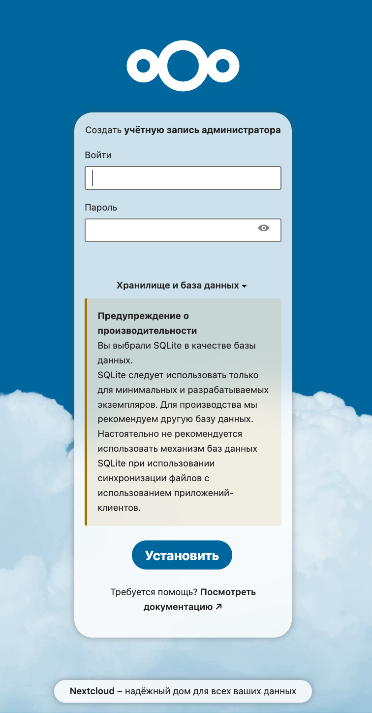
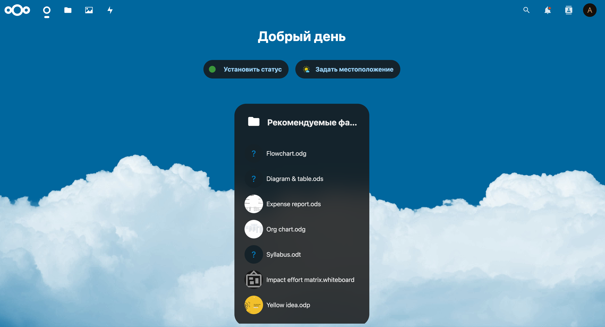

Проверим, что логи записываются в nextcloud.log:

```
docker exec -it <ID контейнера> bash
cat data/nextcloud.log
```

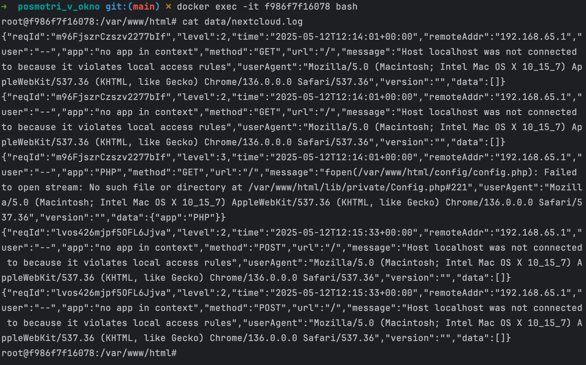

После того как _Nextcloud_ настроен, необходимо убедиться, что _Promtail_ корректно отслеживает нужный файл логов.

```
docker logs promtail
```

Найдите записи, содержащие сообщение: `msg=Seeked/opt/nc_data/nextcloud.log`. Если она, то 
_Promtail_ успешно обнаружил указанный файл логов и сервис начал отслеживать изменения в файле.

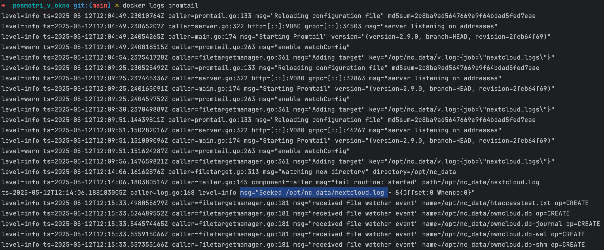

### Часть 2. Настройка мониторинга.

Откройте веб-интерфейс Zabbix по адресу http://localhost:8082/ (или используйте порт, который вы указали в файле 
docker-compose) и войдите в систему под учётной записью администратора: **логин: Admin**, **пароль: zabbix**.

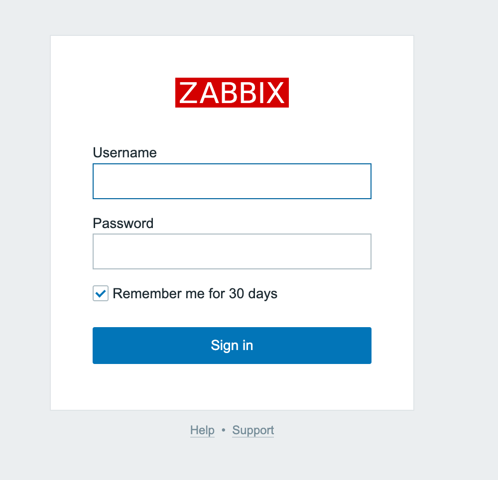

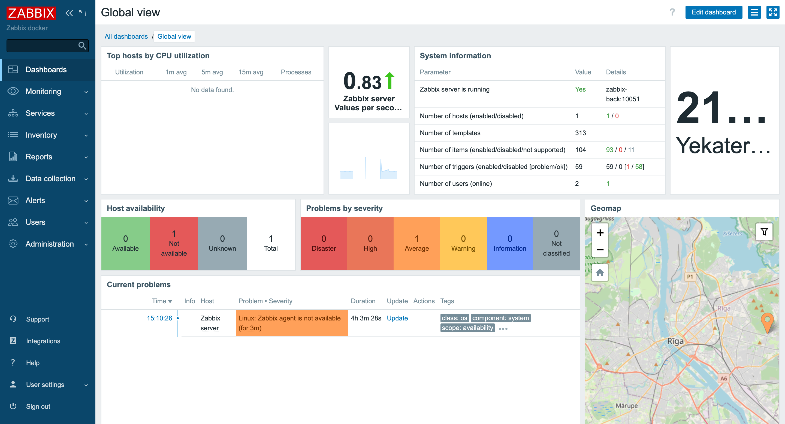

Для настройки мониторинга Nextcloud выполните следующие действия:

- Перейдите в раздел `Data collection → Templates`;
- Нажмите кнопку `Import` для загрузки кастомного шаблона мониторинга;
- Перед импортом необходимо подготовить конфигурационный файл: [template.yaml](template.yml).

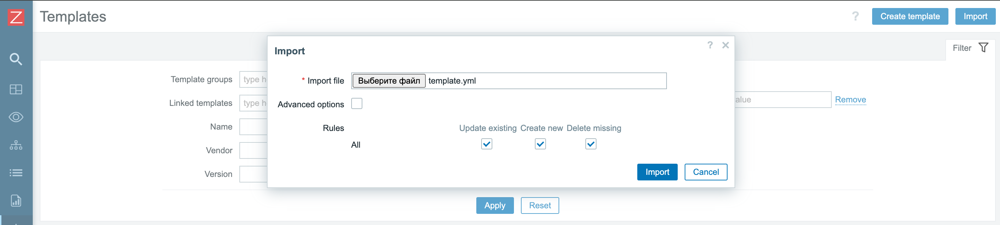

Чтобы _Zabbix_ и _Nextcloud_ могли взаимодействовать через их короткие имена внутри сети _Docker_, 
необходимо разрешить это имя в _Nextcloud_. Для этого войдите в контейнер _Nextcloud_ под пользователем 
`www-data` и выполните команду:

```
docker exec -u www-data -it nextcloud bash
php occ config:system:set trusted_domains 1 --value=“nextcloud”
```

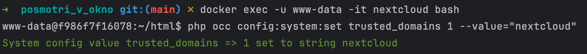

Для настройки мониторинга _Nextcloud_ в _Zabbix_ выполните следующие действия:

- Перейдите в раздел `Data collection → Hosts`;
- Нажмите кнопку `Create host`;
- Заполните необходимые поля:
  - **Адрес хоста**: укажите имя контейнера _Nextcloud_;
  - **Видимое имя**: выберите любое удобное название;
  - **Группа хостов**: выберите `Applications` (или любую другую группу по вашему усмотрению);
- Для активации мониторинга подключите шаблон:
  - В поле `Templates` найдите и выберите шаблон, который вы добавили ранее;
  - Конкретно для базового тестирования выберите `Test ping template` из раздела `Templates/Applications`.

После сохранения настроек _Zabbix_ начнет мониторинг указанного хоста согласно выбранному шаблону.

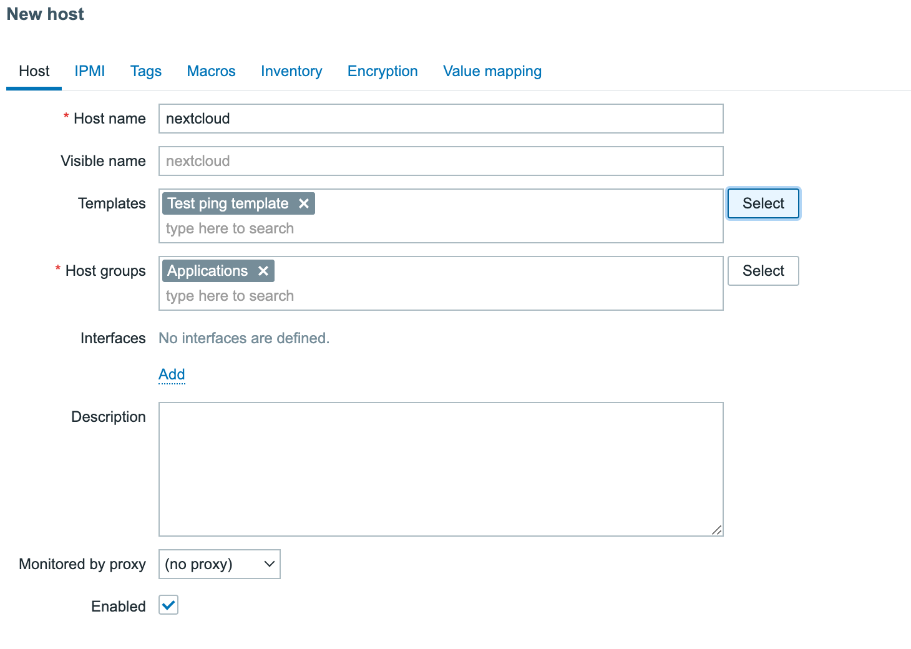

**Поздравляю!** Вы успешно настроили мониторинг _Nextcloud_ с помощью _Zabbix_. Теперь вы можете следить за состоянием
вашего сервера и своевременно реагировать на возможные проблемы.

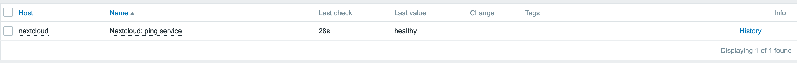

Мониторинг можно считать настроенным после появления первых данных в системе. Для проверки корректности работы 
мониторинга рекомендуется выполнить тестовую проверку:

1. Включите режим обслуживания в _Nextcloud_:
   - Войдите в контейнер _Nextcloud_;
   - Выполните команду: `php occ maintenance:mode --on`;
2. Проверьте срабатывание триггера:
   - Перейдите в раздел `Monitoring → Problems`;
   - Дождитесь появления проблемы в списке;
3. Выключите режим обслуживания:
   - Выполните команду: `php occ maintenance:mode --off`;
4. Убедитесь в корректной работе:
   - Проверьте, что проблема в _Zabbix_ отмечена как “решенная”;
   - Дождитесь обновления статуса до `healthy`.

Эта проверка подтверждает, что:
- Мониторинг настроен правильно
- Триггеры работают корректно
- Система своевременно реагирует на изменения состояния _Nextcloud_

После успешной проверки можно считать мониторинг полностью настроенным и готовым к использованию.

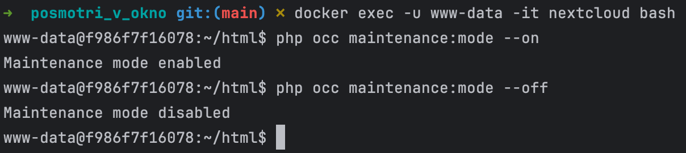

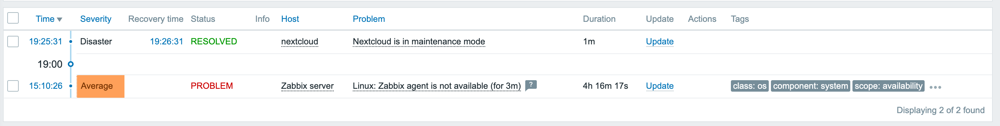

### Часть 3. Настройка визуализации.

Установим плагина _Zabbix_ для _Grafana_:
- Выполните в терминале: `docker exec -it grafana bash -c "grafana cli plugins install alexanderzobnin-zabbix-app"`;
- Перезапустите _Grafana_: `docker restart grafana`.

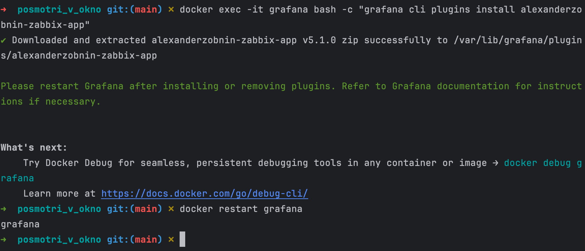

Активируем плагин в _Grafana_:
- Откройте _Grafana_ по адресу http://localhost:3000/;
- Перейдите в `Administration → Plugins`;
- Найдите плагин _Zabbix_ и включите его (**Enable**).

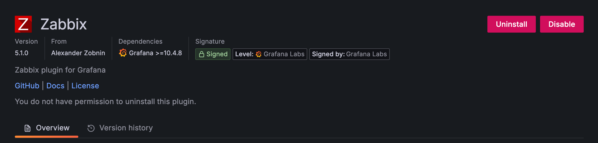

Настройка подключения _Loki_:
- В Grafana перейдите в _Connections → Data sources → Loki_;
- Укажите имя и адрес: http://loki:3100;
- Остальные настройки оставьте по умолчанию;
- Нажмите `Save & Test`.

Если на этапе тестирования (Save & Test) нет ошибок и система предлагает перейти к визуализации данных, 
значит интеграция настроена корректно.

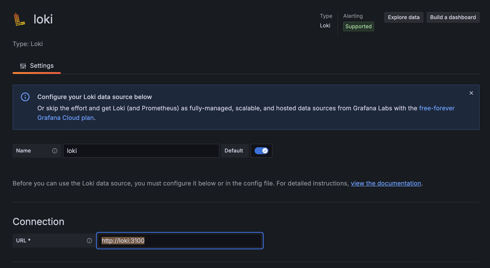
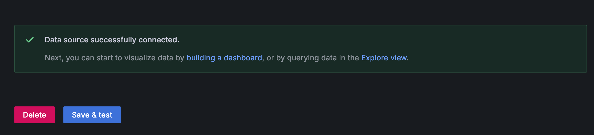

Настройка подключения Zabbix:
- Добавьте новый источник данных (**Data source**);
- Выберите _Zabbix_;
- Укажите URL: http://zabbix-front:8082/api_jsonrpc.php;
- Заполните `Username` и `Password`;
- Проверьте подключение через `Save & Test`.

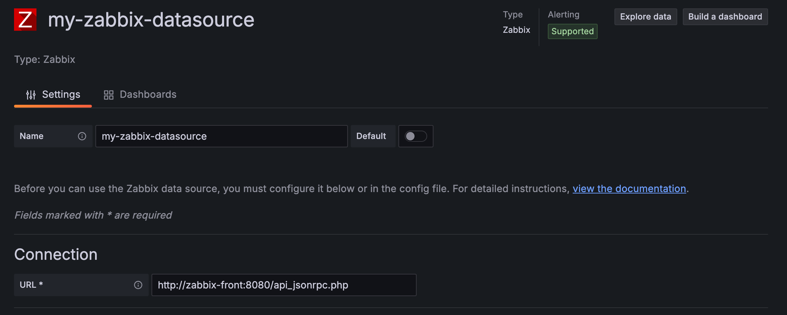
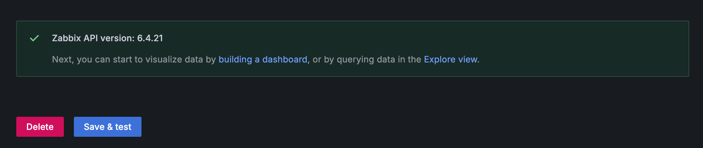

Проверка работы:
- Перейдите в `Explore`;
- Установите все необходимые фильтры;
- Проверьте отображение данных.

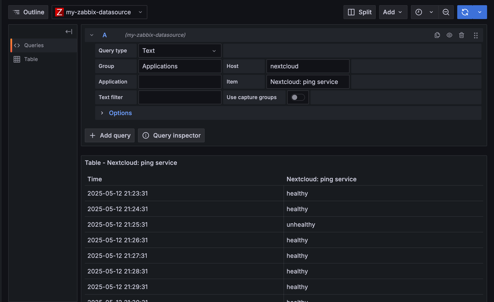

**Готово!**

## Задание.

1. "Поиграться" с запросами.
2. Создать два простеньких дашборда в _Grafana_ с использованием датасурсов _Zabbix_ и _Loki_.

### Создание дашбордов в Grafana для мониторинга Nextcloud.
#### Дашборд 1: Статус Nextcloud (с использованием Zabbix).

Этот дашборд будет показывать текущий статус _Nextcloud_ в виде цветной плашки, меняющей цвет в зависимости от состояния 
сервиса.

Шаги создания:
- Откройте _Grafana_ (http://localhost:3000);
- Перейдите в `Dashboard → New → New Dashboard`;
- Нажмите `Add visualization`;
- Выберите источник данных _Zabbix_.
- 
Настройте запрос:
- В секции **Query** выберите `Problems`;
- **Group**: Applications (или группа, где находится ваш хост Nextcloud);
- **Host**: Nextcloud;
- **Application**: Service state;
- **Problem**: выберите "Nextcloud service is DOWN".

В настройках визуализации:
- Выберите тип `Stat`;
- В разделе `Value options`:
  - **Show**: "Calculate";
  - **Calculation**: "Last non-null value";
- В разделе **Text mode**: "Value and name";
- В разделе **Thresholds**:
  - **Base**: 0;
  - **Critical**: 1 (когда есть проблема);
  - **Type**: "Absolute"'
  - **Color scheme**: "Red, Green" (красный для проблемы, зеленый для нормального состояния);
- В разделе **Value mappings**:
  - Добавьте маппинг: 0 → "HEALTHY";
  - Добавьте маппинг: 1 → "DOWN";
- В разделе **Options**:
  - **Text size**: "Title" установите большой размер;
  - **Background mode**: "Gradient".

#### Дашборд 2: Логи Nextcloud (с использованием Loki).

Этот дашборд будет отображать логи _Nextcloud_ в виде таблицы для мониторинга событий в системе.

Шаги создания:
- Откройте Grafana (http://localhost:3000);
- Перейдите в `Dashboard → New → New Dashboard`;
- Нажмите `Add visualization`;
- Выберите источник данных _Loki_.

Настройте запрос:
- В строке запроса введите: `{container="nextcloud"}`;
- Для более специфичной фильтрации можно использовать: `{container="nextcloud"} |~ "error|warning|notice"`.

В настройках визуализации:
- Выберите тип `Logs`;
- В разделе `Options`:
  - **Show time**: Включено;
  - **Order**: "Newest first";
  - **Deduplication**: "Exact";
- В разделе `Standard options`:
  - Настройте цветовую схему для различных уровней логов:
    - error → красный;
    - warning → оранжевый;
    - notice → синий;
    - info → зеленый;
  - Добавьте заголовок: "Nextcloud Logs".

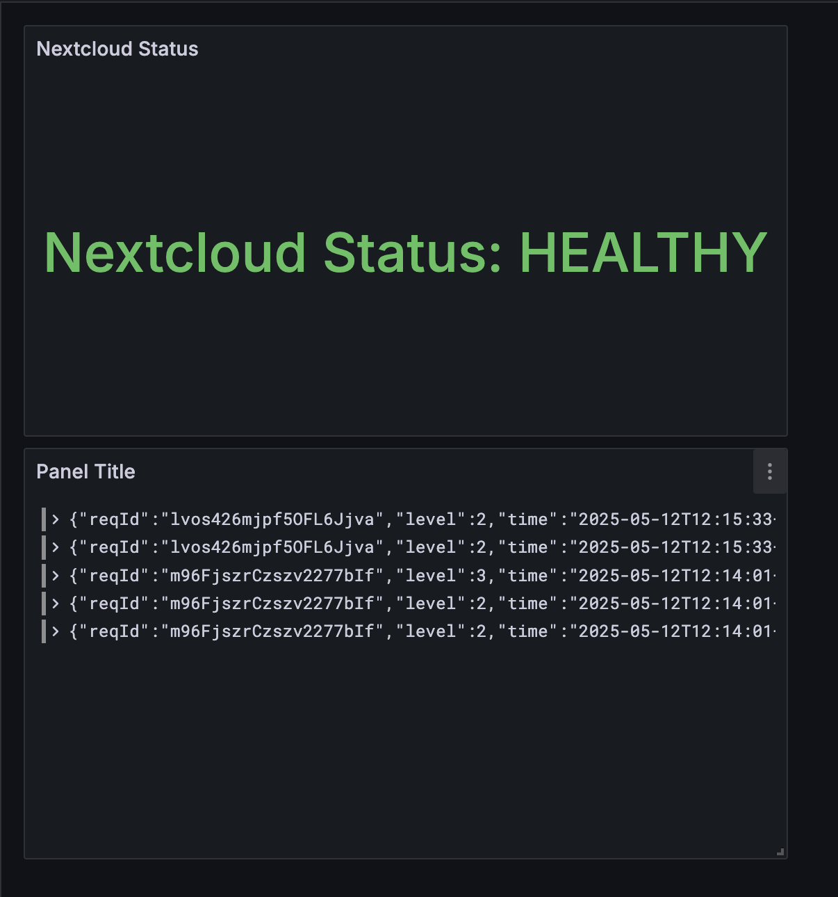

## Вопрос - ответ.

1. В чем разница между мониторингом и observability?

<details>
  <summary>Ответ</summary>
  Мониторинг — это когда ты просто смотришь, работает система или нет, типа как лампочки на приборной панели машины. 
  Ты видишь, ЧТО сломалось, но не понимаешь почему. А observability (наблюдаемость) — это когда система как бы 
  "прозрачная", и ты можешь залезть внутрь, покопаться и понять ПОЧЕМУ что-то пошло не так, даже если раньше такой 
  проблемы не было. Мониторинг говорит "сервер упал", а наблюдаемость помогает выяснить всю цепочку событий, которая 
  к этому привела.
</details>

## Вывод.

В результате мы научились настраивать систему мониторинга и логирования для сервиса _Nextcloud_ с последующей 
визуализацией данных в _Grafana_.
