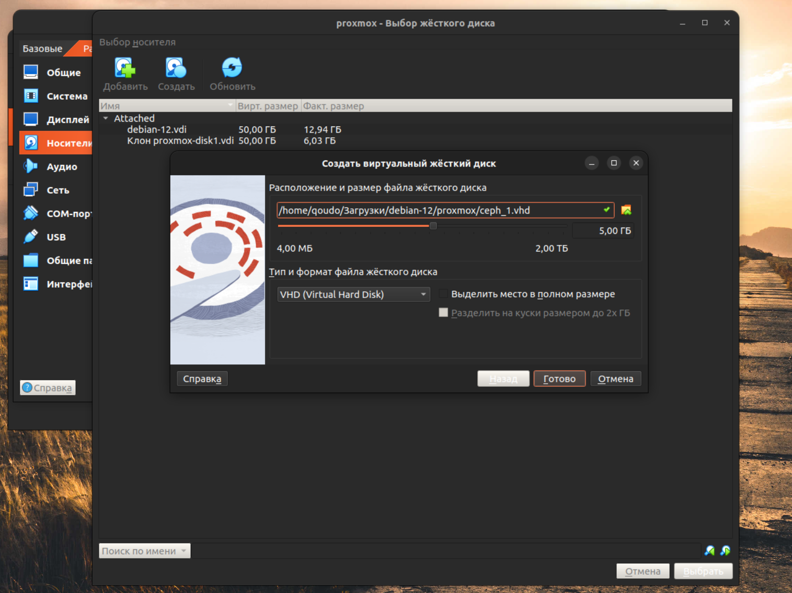
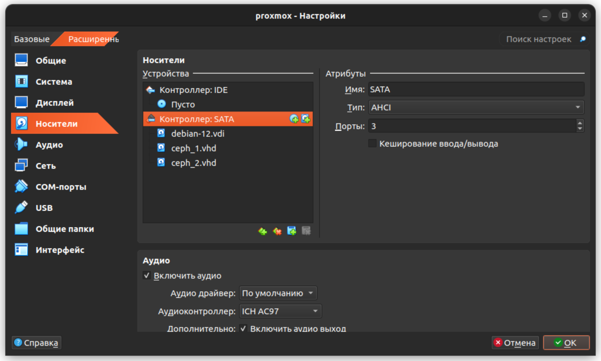
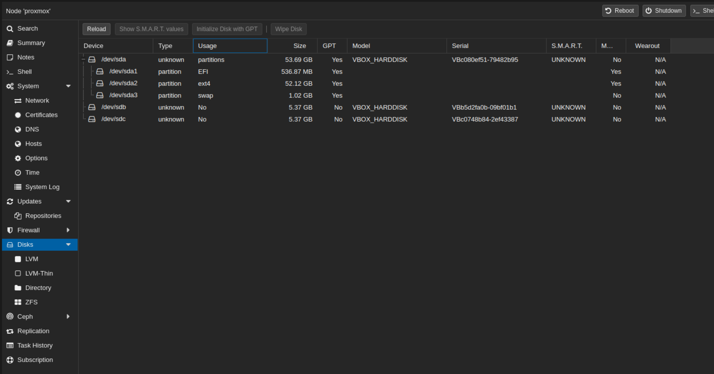
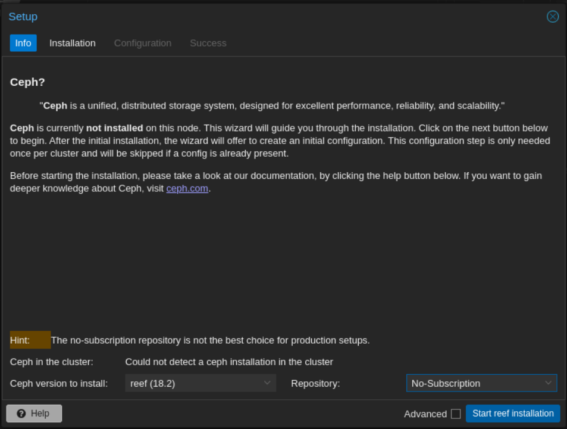
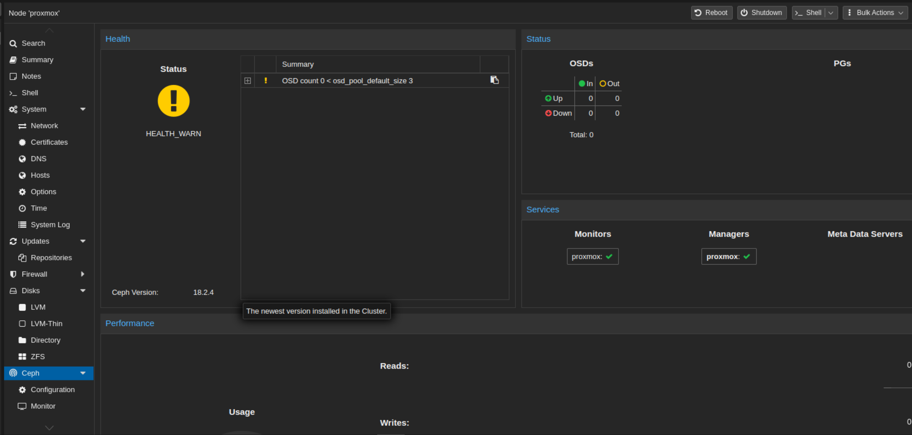
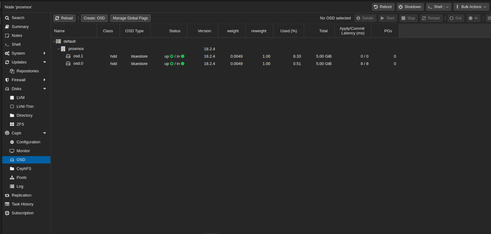
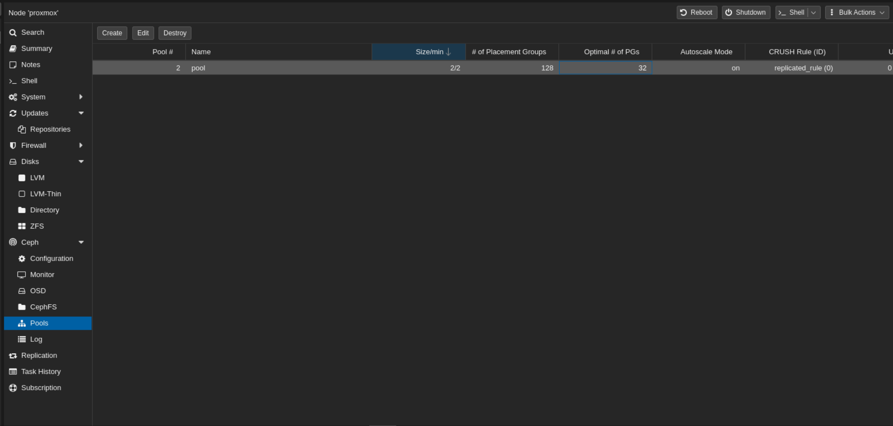
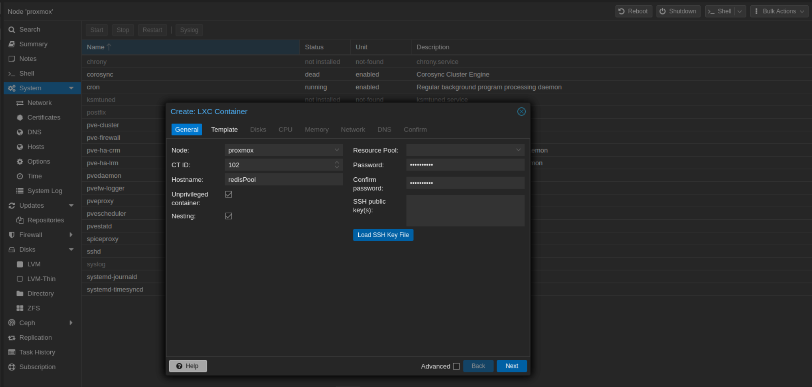
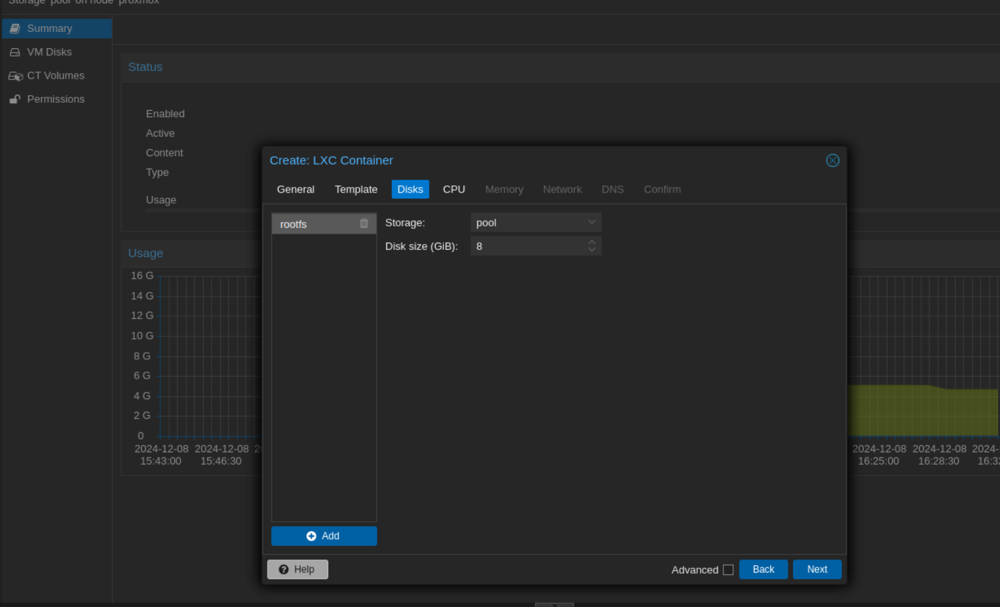

# Лабораторная работа №3 - Настройка объектного хранилища _Ceph_

## Цель работы

Научится устанавливать и настраивать объектное хранилища _Ceph_, познакомиться с принципами работы.

## Ход работы

### 1. Подключение доп. дисков к _Proxmox_

Для установки и настройки _Ceph_ нам потребуются дополнительные диски, которые не используются самим _Proxmox_. 
Поэтому подключим к нашей ВМ два диска. 
В _VirtualBox_ выбираем пункт `Настроить` → `Носители` → `Контроллеры SATA` → `Добавить жесткий диск` → `Создать`. 

Установим следующие параметры:
* **Формат**: VHD;
* **Место** В полном размере;
* **Объем**: От 5 до 20гб;
* **Имя**: `ceph_1` и `ceph_2`.

Подключаем диски:

Запускаем ВМ и проверяем, что Proxmox видит наши диски:

### 2. Установка _Ceph_

В меню находим пункт `Ceph`. Так как у нас его еще нет, _Proxmox_ предложит установить его. 
Устанавливаем, не забывая выбрать репозиторий `No-subscription` (поскольку у нас бесплатная версия).
В разделе `Configuration` выбираем нашу сеть.

> В разделе Ceph должно отобразиться текущие состояние. Сначала статус будет зеленый, но затем сменится на желтый,
> не стоит этого пугаться т.к. в наш _Ceph_ не добавлены сами диски для работы (_OSD_).

### 3. Настройка _Ceph_

В разделе `Ceph` выбираем пункт `OSD` и добавляем наши два диска в кластер с помощью кнопки `Create OSD` 
(параметры оставим по умолчанию). После непродолжительного ожидания нажимаем `Reload` и видим, что два новых _OSD_ диска 
появились и находятся в состоянии _up_.

Создаем дисковый пул в разделе `Pools`. Имя пула может быть любым, а размер устанавливаем немного меньше суммы объемов 
двух дисков. Теперь этот пул можно использовать в качестве источника хранения при создании виртуальных машин или 
контейнеров (в разделе `Disks` при создании).

## Задание

Создать контейнер из доступных шаблонов или выбрать любой другой, выбрав в качестве системы хранения не локальный диск, 
а пул, созданный на **шаге 7**. Способ создания - через веб-интерфейс или командную строку 
(см. [Лабораторную работу №2](../lab_2/REPORT.md)).

  
Решение

  В левом меню выбираем в качестве хранилища наш pool и нажимаем кнопку Create CT, действуем аналогично как в 
  лабораторной работе №2.
  
  
   
   Но с одним отличием, в качестве диска выбираем наш pool.
  
  

  В результате получаем контейнер в объектном хранилище.

## Вопрос - ответ

**Вопрос**: Чем объектное хранилище отличается от обычного?

  
Ответ

  Вместо привычной файловой системы используется единое пространство, заполненное множеством объектов. 
  Каждый объект имеет свой уникальный идентификатор и метаданные. Это позволяет работать с огромными объемами информации.

  Такое хранилище часто применяют для хранения резервных копий данных и восстановления информации в случае аварий.

  Объектное хранилище идеально подходит для работы с большими объемами данных и сложными задачами управления информацией, 
  тогда как файловое хранилище удобнее использовать для небольших и разнообразных наборов данных.

## Вывод

В результате:
- Узнали, что такое объектное хранилища, принцип его работы и когда лучше использовать;
- Научились устанавливать и настраивать объектное хранилища _Ceph_ в _Proxmox_;
- Научились развертывать контейнеры внутри объектного хранилища.

[назад](../lab_2/REPORT.md) | [меню](../../README.md)
